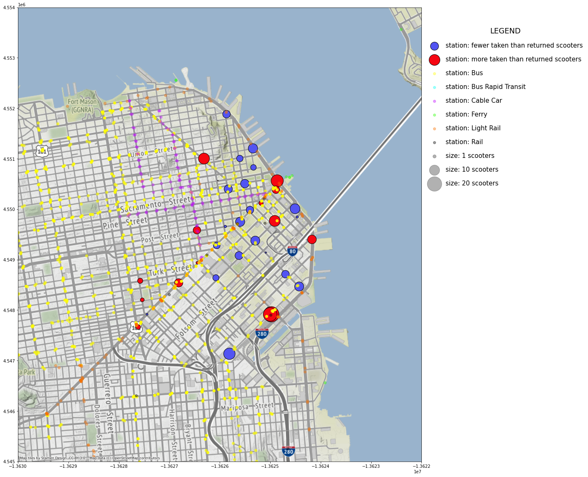

# Scooter Task

Task from [Kaggle](https://www.kaggle.com/benhamner/sf-bay-area-bike-share) to analyse the scooter transportation in San Francisco.

It explores the data set in the following direction:
* The duration of trips: how long will the trips generally take.
* The volumn of scooter travelling in different time and different days.
* The travelling bahaviour in the peak hours of scooter usage. E.g. Is there a significant trend to travel to certain station at certain time.
* The number of scooters needed for each station on weekday and weekends.
* The change in number of scooters after each day of operation at each station.

Possible business insights:
* The analysis can suggest a reasonable battery capacity of the scooters to the stakeholders.
* It provides insights on optimizing the allocation of scooters such that the demand can be fulfilled to the best extent.

To View the cell outputs, please refer to this Kaggle [kernel](https://www.kaggle.com/yingxuhe/sf-bike-share-he-yingxu).

## Credit:
* [Major Transit Stops (2017)](http://opendata.mtc.ca.gov/datasets/major-transit-stops-2017) dataset provided by [MTC GIS](http://gis.mtc.ca.gov/home/#we-are-mtc).
